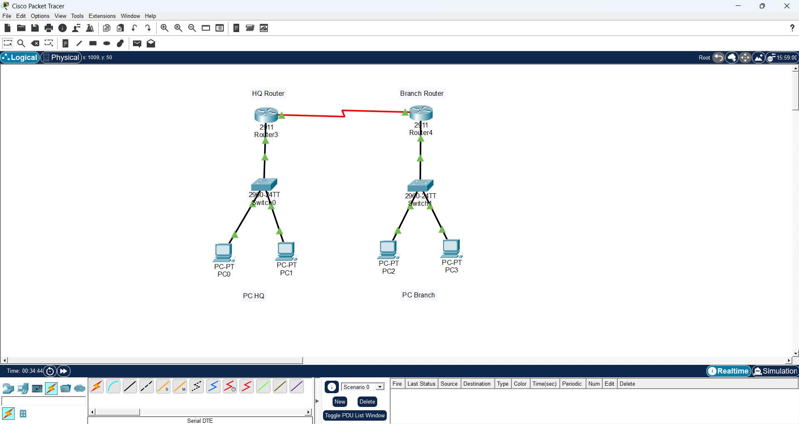
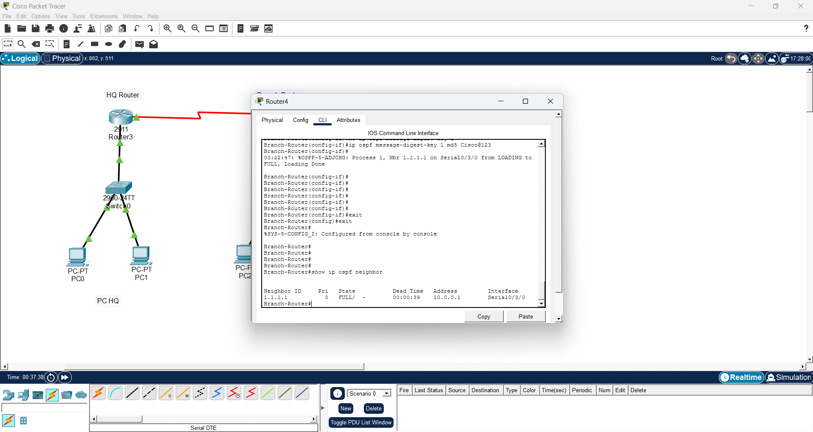
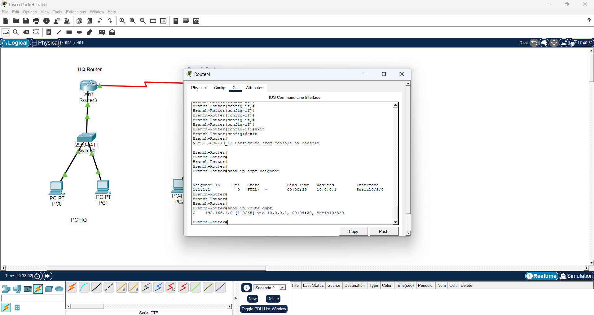
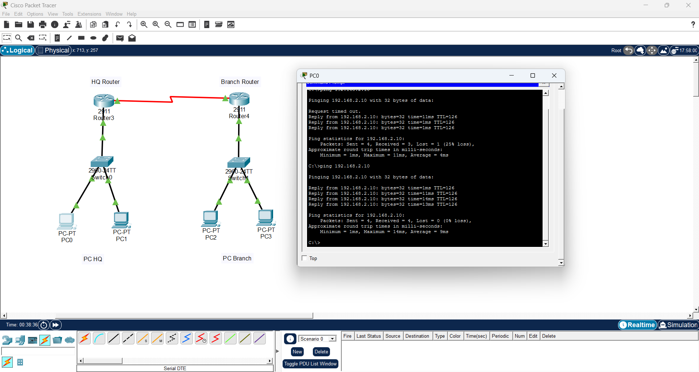

# Multi-Branch Enterprise Network Architecture (OSPF & MD5 Security)

## 📌 Project Overview
This project demonstrates the design and deployment of a multi-branch enterprise network topology. It implements dynamic interior routing via **OSPF (Open Shortest Path First)** across disparate subnets and hardens the routing protocol exchanges using cryptographic **MD5 Authentication** to prevent unauthorized routing updates and route poisoning.

---

## 🏗️ Network Architecture & Topology
The topology consists of two distinct branch environments connected across a WAN serial link, dynamically exchanging routing updates through a single OSPF Area 0 backbone.

  

### Addressing & Routing Schema:
| Network Segment | Device / Interface | Subnet / IP Address | Routing Protocol | Security / Authentication |
| :--- | :--- | :--- | :--- | :--- |
| **HQ LAN (Subnet A)** | `HQ-Router` (Gi0/0) | `192.168.1.0/24` | OSPF Area 0 | None (Internal LAN) |
| **WAN Serial Link** | Inter-Router (`S0/3/0`) | `10.0.0.0/30` | OSPF Area 0 | **MD5 Authentication** (`Cisco@123`) |
| **Branch LAN (Subnet B)** | `Branch-Router` (Gi0/0) | `192.168.2.0/24` | OSPF Area 0 | None (Internal LAN) |

---

## 🔍 Verification & Testing

### 1. Topology Overview:
The multi-branch network topology deployed with dynamic routing and point-to-point serial connectivity:

### 2. OSPF Neighbor Adjacency:
Verification on `HQ-Router` confirming neighbor `2.2.2.2` reaches the `FULL` state over MD5-authenticated link:

### 3. Routing Table Inspection:
Verifying the routing table on `HQ-Router` showing routes learned via OSPF (marked with the `O` flag):

### 4. End-to-End Ping Verification:
Successful ICMP reachability test from HQ workstation (`PC0`) to Branch workstation (`PC2`):

---

## 📁 Project Lab File
Download and inspect the complete Cisco Packet Tracer simulation topology:

📥 **[Download MultiBranch_OSPF_MD5_Architecture.pkt](./MultiBranch_OSPF_MD5_Architecture.pkt)**
! Applied on router serial interfaces:
ip ospf authentication message-digest
ip ospf message-digest-key 1 md5 Cisco@123
